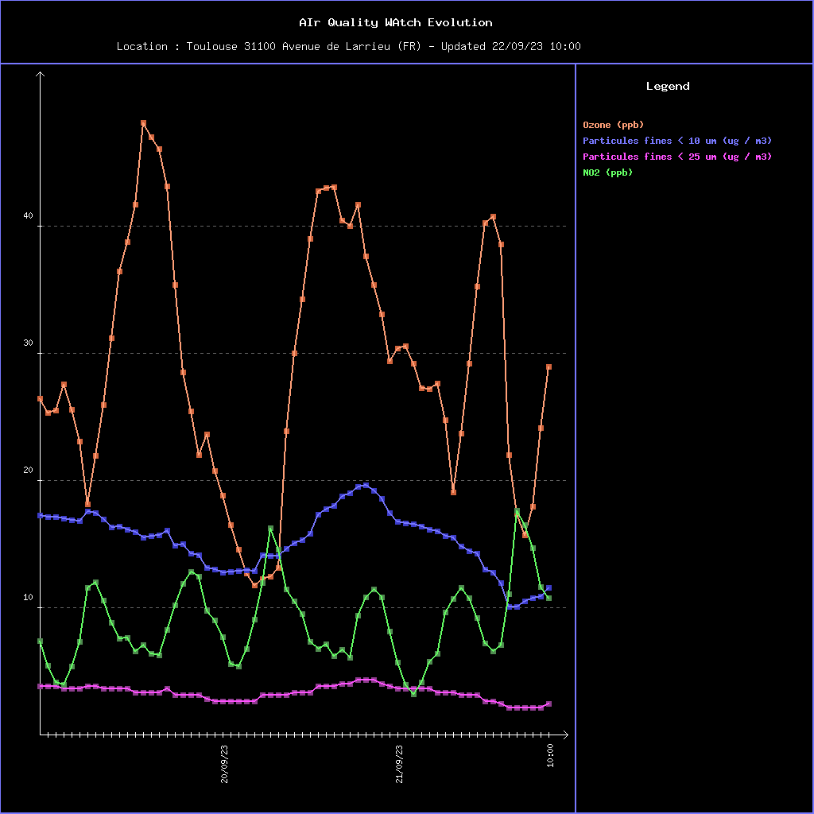

# LinuxCppEmbarque AIQWA
Exploitation d'une API en CPP sur Linux embarqué

## Projet basé sur buildroot qemu

## Documentation

* Documentation au format html dans file://documentation/html/index.html 

## Sources

* Sources C++ dans /devel/AIrQualityWAtch
* Shell scripts dans /devel/scripts
* overlay/home/sylvain doit contenir un fichier AIQWA.config qui contient les parametres d'accès à l'API et les chemins de stockage des datas et charts
* /devel/AIrQualityWAtch contient un script crossCompil qui copie l'executable généré dans overlay/root/bin/airQualityWatch-qemu

## Datas & Charts
* Un fichier json AirQualityWatch.json dans /home/sylvain/datas est incrémenté à chaque download et contient toutes les données.
* /devel/scripts contient un shell script qui reconstitue  le fichier AirQualityWatch.json en cas de besoin à partir des données brutes.
*  airQualityWatch-qemu est appelé par cron toutes les 5 * * * *. Il télécharge et enregistre les données, génère et enregistre les charts.
*  Les datas récupérées sur l'API sont stockées dans overlay/home/sylvain/datas
* Les graphiques générés sont enregistrés dans overlay/home/sylvain/charts

## Server httpd
* Un dossier /root/html (cf dans overlay) contient les fichier index.html et styles.css, ainsi qu'un lien symbolique vers /home/sylvain
* un server busybox httpd écoute le port 80
* le port 8080 de la machine hôte est redirigé vers le port 80 de la machine qemu.
* le port 58080 de la passerelle est redirigé vers le port 8080 de la machine hôte
* Les graphiques sont accessibles par http://88.179.9.133:58080/  

## Ebauche de rapport dans Procedure.pdf
## exemples de datas json dans /datas
## exemples de graphiques dans /charts

