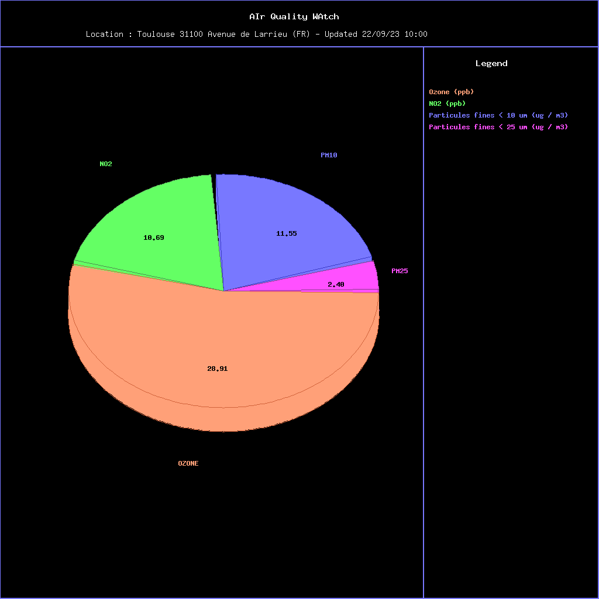

# LinuxCppEmbarque AIQWA
Exploitation d'une API en CPP sur Linux embarqué

## Projet basé sur buildroot qemu
## Utilisation des données fournies par api.ambeedata.com

## Installation en local

* ./install.sh à la racine du projet
* ./airQualityWatch

## Sources

* Sources C++ dans /devel/AIrQualityWAtch
* Shell scripts dans /devel/scripts
* /devel/AIrQualityWAtch contient un script crossCompil qui copie l'executable généré dans overlay/home/sylvain/airQualityWatch-qemu
* Toute la configuration buildroot est dans /buildroot/buildroot-work/

## Datas & Charts
* Un fichier json AirQualityWatch.json dans datas/ est incrémenté à chaque download et contient toutes les données.
* airQualityWatch-qemu est appelé par cron toutes les 5 * * * *. Il télécharge et enregistre les données, génère et enregistre les charts.
*  Les datas récupérées sur l'API sont stockées dans overlay/home/sylvain/datas
* Les graphiques générés sont enregistrés dans overlay/home/sylvain/charts
* Une sauvegarde au format tarball est générée toutes les heures et est accessible depuis le site http://88.179.9.133:58080/

## Documentation
* Le dossier /documentation contient une doc Doxygen au format html et au format latex / pdf. Cette documentation est également accessible sur le site http://88.179.9.133:58080/
* Le fichier _presentation.pps_ contient une présentation du projet
* Le fichier _procedure.pdf_ expose les étapes principales de la configuration buildroot - qemu

## Server httpd
* Un dossier /root/html (cf dans overlay) contient les fichier index.html et styles.css, ainsi que des liens symbolique vers /home/sylvain
* un server busybox httpd écoute le port 80
* le port 8080 de la machine hôte est redirigé vers le port 80 de la machine qemu.
* le port 58080 de la passerelle est redirigé vers le port 8080 de la machine hôte
* Les graphiques sont accessibles par http://88.179.9.133:58080/  

## exemples de datas json dans /datas
## exemples de graphiques dans /charts

